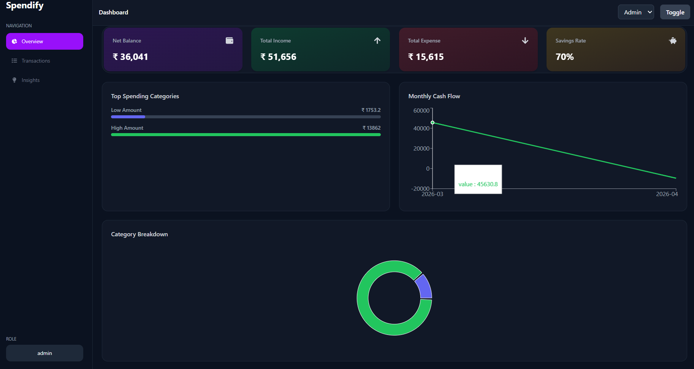
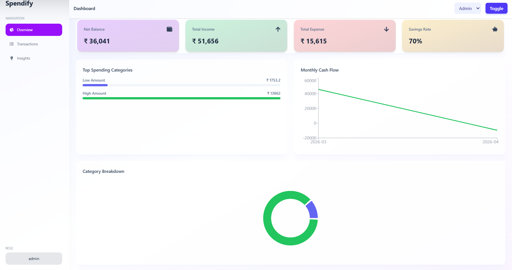
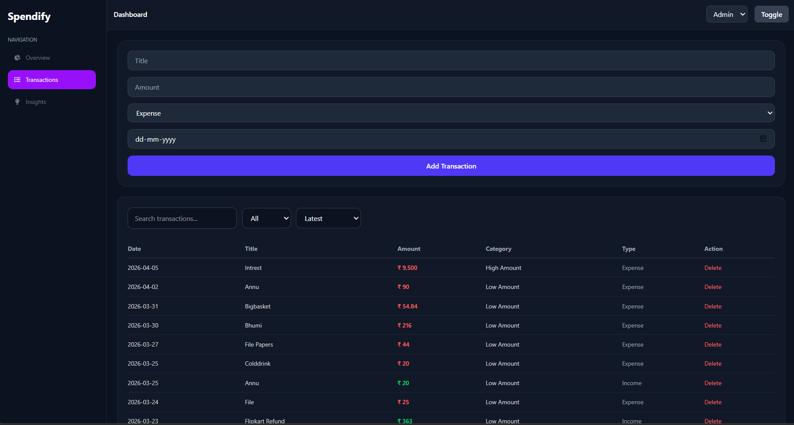
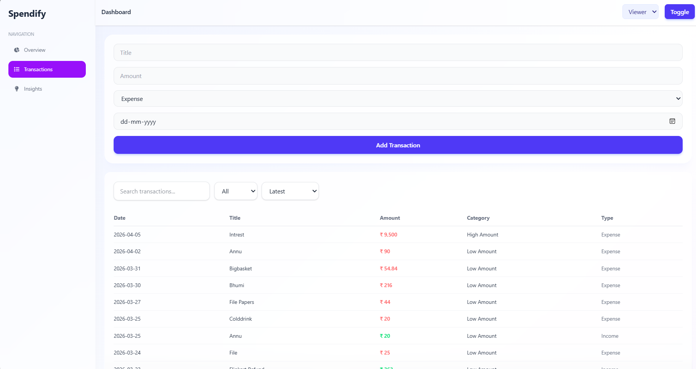
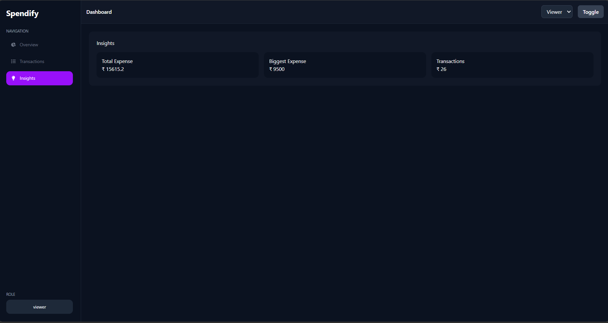

# 💸 Spendify - Finance Dashboard

A sleek and modern finance dashboard built with **React**, **Vite**, and **TailwindCSS**. Spendify allows users to monitor their transactions, view powerful insights via interactive charts, and manage their expenses with a beautiful, dynamic user interface.

## ✨ Features
- **Interactive Dashboard:** High-level summary of your financial health.
- **Transactions Management:** View and add your daily transactions with ease.
- **Data Insights:** Visualize income versus expenses using beautifully crafted charts.
- **Modern UI:** Designed with premium styling, dark mode support, and smooth micro-animations.
- **Responsive:** Fully responsive design adapting perfectly to mobile, tablet, and desktop screens.

## 📸 Screenshots

Here is a glimpse of the Spendify dashboard and its features:







*(Full size screenshots available in the `docs/screenshots` directory)*

## 🚀 Tech Stack
- **Framework:** [React 19](https://react.dev/) + [Vite](https://vitejs.dev/)
- **Styling:** [Tailwind CSS 4](https://tailwindcss.com/)
- **Routing:** [React Router v7](https://reactrouter.com/)
- **Data Visualization:** [Recharts](https://recharts.org/)
- **Icons:** [React Icons](https://react-icons.github.io/react-icons/)
- **Alerts:** [SweetAlert2](https://sweetalert2.github.io/)

## 📂 Project Structure
```text
Spendify---Finance_Dashboard/
 ├── docs/
 │    └── screenshots/        # Project screenshots
 ├── public/                  # Static assets
 ├── src/
 │    ├── assets/             # Images and SVGs
 │    ├── components/         # Reusable UI components
 │    │    ├── dashboard/     # Dashboard specific blocks
 │    │    ├── forms/         # Data entry forms
 │    │    └── layout/        # Sidebar, Topbar
 │    ├── context/            # React Context for global state
 │    ├── pages/              # Route pages (Dashboard, Insights, Transactions)
 │    ├── App.jsx             # Main Application layout & Router
 │    ├── index.css           # Global CSS and Tailwind definitions
 │    └── main.jsx            # React Entry Point
 ├── .gitignore
 ├── eslint.config.js         # Linter config
 ├── package.json
 ├── tailwind.config.js
 └── vite.config.js
```

## 🛠️ Getting Started

1. **Clone the repository:**
   ```bash
   git clone https://github.com/Nidhigupta2203/Spendify---Finance_Dashboard.git
   cd Spendify---Finance_Dashboard
   ```

2. **Install dependencies:**
   ```bash
   npm install
   ```

3. **Start the development server:**
   ```bash
   npm run dev
   ```

4. **Build for production:**
   ```bash
   npm run build
   ```

## 🤝 Contributing
Contributions, issues, and feature requests are welcome! Feel free to check the [issues page](https://github.com/Nidhigupta2203/Spendify---Finance_Dashboard/issues).
